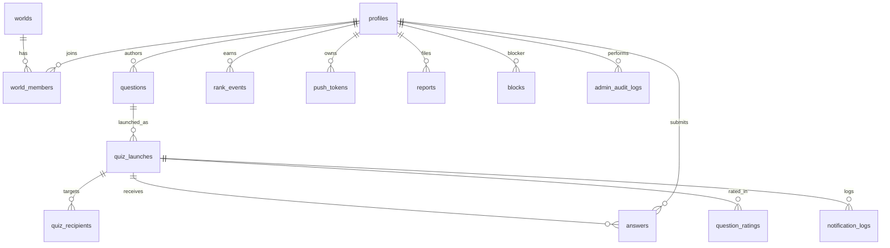

# 通知型早押しクイズワールド データモデル設計

## 前提

本ドキュメントはMVP向けの論理データモデルであり、DB migration ではない。
既存の Smart Buzzer の Supabase project、production database、RLS、env、legal page には触れない。

MVPでは1ワールドだけを作る想定だが、将来の拡張を考慮して worlds / world_members を持つ。

## 設計方針

- MVPでは world は1件だけ。
- world.member_limit は10から開始する。
- 新規登録時に world_members の有効メンバー数が member_limit 以上なら waitlist へ誘導する。
- MVPでは guilds / guild_members は作らなくてもよい。
- 将来 quiz_launches に guild_id nullable を追加できる余地を残す。
- 順位判定はサーバー受信時刻を使う。
- 回答者の端末時刻は使わない。
- profiles に生年月日は持たない。
- profiles.role をglobal admin判定に使う。
- profiles.status をglobalな利用状態に使う。
- world_members.role はMVP admin判定ではなく、将来の複数ワールド管理に備えたworld内roleとして使う。
- 18歳以上確認は age_confirmed_at で保持する。
- 規約同意は terms_accepted_at で保持する。
- プライバシーポリシー同意は privacy_accepted_at で保持する。
- RLS前提で、ユーザーごとの参照・更新範囲を制御する。

## ER概要

## MVPテーブル

### worlds

ワールド全体の状態を持つ。MVPでは1件だけを想定する。

| カラム | 型の目安 | 説明 |
| --- | --- | --- |
| id | uuid | ワールドID。 |
| name | text | 表示名。例: クイズワールド。 |
| member_limit | integer | 参加枠。初期値10。 |
| current_season | integer | Season 0から開始。 |
| status | text | active, paused, archived など。 |
| created_at | timestamptz | 作成日時。 |
| updated_at | timestamptz | 更新日時。 |

### world_members

ユーザーがどのワールドに所属しているかを表す。

| カラム | 型の目安 | 説明 |
| --- | --- | --- |
| id | uuid | メンバーID。 |
| world_id | uuid | worlds.id。 |
| user_id | uuid | profiles.id または auth.users.id。 |
| role | text | member, world_admin。MVPのadmin画面判定には使わない。 |
| joined_at | timestamptz | 参加日時。 |
| status | text | active, suspended。world内の参加状態。 |

MVPでは1ユーザー1ワールド所属とする。

### profiles

ユーザーの公開プロフィール、ランク、通知設定、同意状態を持つ。

| カラム | 型の目安 | 説明 |
| --- | --- | --- |
| id | uuid | ユーザーID。auth.users.id と対応。 |
| display_name | text | 表示名。 |
| avatar_url | text | アバターURL。 |
| role | text | user, admin。MVPのglobal admin判定に使う。 |
| status | text | active, suspended。停止時は出題/回答/admin対象操作を制限する。 |
| answer_rank | integer | 回答ランク。 |
| answer_score | integer | 回答スコア。 |
| questioner_rank | integer | 出題ランク。 |
| questioner_score | integer | 出題スコア。 |
| notification_mode | text | normal, focus, rest, night など。 |
| quiet_hours_start | time | 通知を止める開始時刻。 |
| quiet_hours_end | time | 通知を止める終了時刻。 |
| max_daily_notifications | integer | 1日の通知上限。 |
| deep_night_notifications_enabled | boolean | 深夜通知を許可するか。 |
| age_confirmed_at | timestamptz | 18歳以上確認日時。 |
| terms_accepted_at | timestamptz | 利用規約同意日時。 |
| privacy_accepted_at | timestamptz | プライバシーポリシー同意日時。 |
| created_at | timestamptz | 作成日時。 |
| updated_at | timestamptz | 更新日時。 |

生年月日はMVPでは保存しない。

### waitlist

参加枠が満員のときの登録待ちを管理する。

| カラム | 型の目安 | 説明 |
| --- | --- | --- |
| id | uuid | ウェイトリストID。 |
| email | text | 連絡先メール。 |
| display_name | text | 希望表示名。 |
| status | text | waiting, invited, rejected, joined など。 |
| created_at | timestamptz | 登録日時。 |

### invites

招待制または管理者承認制の招待コードを管理する。

| カラム | 型の目安 | 説明 |
| --- | --- | --- |
| id | uuid | 招待ID。 |
| world_id | uuid | 対象ワールド。 |
| invited_by | uuid | 招待者。 |
| code | text | 招待コード。 |
| status | text | active, used, revoked, expired など。 |
| expires_at | timestamptz | 有効期限。 |
| created_at | timestamptz | 作成日時。 |

### questions

クイズ本体を管理する。

| カラム | 型の目安 | 説明 |
| --- | --- | --- |
| id | uuid | 問題ID。 |
| author_id | uuid | 出題者ID。 |
| type | text | multiple_choice をMVP標準にする。 |
| body | text | 問題文。 |
| choices | jsonb | 選択肢配列。 |
| correct_choice_id | text | 正解選択肢ID。 |
| correct_answer | text | 短文回答用の正解。MVPでは補助扱い。 |
| answer_aliases | jsonb | 正解別名。次段階用。 |
| difficulty | integer | 難易度。 |
| category | text | 固定カテゴリ。雑学、歴史、地理、科学、エンタメ、スポーツ、言葉、謎解き、その他。 |
| category_note | text | その他を選んだ場合の補足テキスト。nullable。 |
| status | text | draft, active, review_required, suspended など。 |
| created_at | timestamptz | 作成日時。 |
| updated_at | timestamptz | 更新日時。 |

MVPでは correct_choice_id による判定を基本とし、自由入力のAI判定には頼らない。

### quiz_launches

特定の問題を特定のタイミングで配信した単位を表す。

| カラム | 型の目安 | 説明 |
| --- | --- | --- |
| id | uuid | 配信ID。 |
| question_id | uuid | questions.id。 |
| author_id | uuid | 出題者ID。 |
| world_id | uuid | worlds.id。 |
| recipient_count | integer | 配信対象人数。 |
| start_at | timestamptz | 回答開始時刻。サーバーで決定。 |
| end_at | timestamptz | 回答締切時刻。サーバーで決定。 |
| status | text | scheduled, active, closed, cancelled など。 |
| created_at | timestamptz | 作成日時。 |
| updated_at | timestamptz | 更新日時。 |

将来のギルド対応では nullable な guild_id を追加できるようにする。

### quiz_recipients

quiz_launch の通知対象者を管理する。

| カラム | 型の目安 | 説明 |
| --- | --- | --- |
| id | uuid | 対象ID。 |
| launch_id | uuid | quiz_launches.id。 |
| user_id | uuid | 通知対象ユーザー。 |
| notification_status | text | pending, sent, failed, skipped など。 |
| notified_at | timestamptz | 通知送信日時。 |
| opened_at | timestamptz | 通知またはクイズ画面を開いた日時。 |
| created_at | timestamptz | 作成日時。 |

回答できるのは quiz_recipients に存在するユーザーだけにする。

### answers

回答と順位を管理する。

| カラム | 型の目安 | 説明 |
| --- | --- | --- |
| id | uuid | 回答ID。 |
| launch_id | uuid | quiz_launches.id。 |
| user_id | uuid | 回答者ID。 |
| answer_text | text | 短文回答用。MVPでは任意。 |
| normalized_answer | text | 正規化済み回答。次段階用。 |
| choice_id | text | 選択した選択肢ID。 |
| is_correct | boolean | 正解かどうか。 |
| answer_received_at | timestamptz | サーバー受信時刻。 |
| answer_rank | integer | 全回答者内の受信順。 |
| correct_rank | integer | 正解者内の順位。 |
| created_at | timestamptz | 作成日時。 |

同じ launch_id と user_id の組み合わせは1件だけにする。

### question_ratings

回答者によるクイズ評価を管理する。

| カラム | 型の目安 | 説明 |
| --- | --- | --- |
| id | uuid | 評価ID。 |
| launch_id | uuid | quiz_launches.id。 |
| question_id | uuid | questions.id。 |
| rater_id | uuid | 評価者ID。 |
| rating | text | good, normal, weak。 |
| reason | text | 評価理由タグ。任意。 |
| created_at | timestamptz | 作成日時。 |

評価は出題者ランクに反映する。

### rank_events

ランクスコアの増減履歴を保持する。

| カラム | 型の目安 | 説明 |
| --- | --- | --- |
| id | uuid | イベントID。 |
| user_id | uuid | 対象ユーザー。 |
| type | text | answer, questioner, penalty, season など。 |
| points | integer | 加点または減点。 |
| reason | text | 理由。 |
| metadata | jsonb | launch_id, question_id, rank など。 |
| created_at | timestamptz | 作成日時。 |

スコア集計結果だけでなく、説明可能な履歴を残す。

### push_tokens

Web Push や将来のネイティブPush用トークンを管理する。

| カラム | 型の目安 | 説明 |
| --- | --- | --- |
| id | uuid | トークンID。 |
| user_id | uuid | 所有ユーザー。 |
| provider | text | web_push, expo, fcm, apns など。 |
| token | text | 通知トークン。 |
| platform | text | web, ios, android など。 |
| enabled | boolean | 有効かどうか。 |
| last_seen_at | timestamptz | 最終確認日時。 |
| created_at | timestamptz | 作成日時。 |

### reports

問題、配信、ユーザーに関する通報を管理する。

| カラム | 型の目安 | 説明 |
| --- | --- | --- |
| id | uuid | 通報ID。 |
| question_id | uuid | 対象問題。nullable。 |
| launch_id | uuid | 対象配信。nullable。 |
| reporter_id | uuid | 通報者ID。 |
| reason | text | 通報理由。 |
| status | text | open, reviewing, resolved, dismissed。 |
| created_at | timestamptz | 作成日時。 |
| updated_at | timestamptz | 更新日時。 |

### blocks

ユーザー間のブロック関係を管理する。

| カラム | 型の目安 | 説明 |
| --- | --- | --- |
| id | uuid | ブロックID。 |
| blocker_id | uuid | ブロックしたユーザー。 |
| blocked_id | uuid | ブロックされたユーザー。 |
| created_at | timestamptz | 作成日時。 |

ブロック関係がある場合、通知対象抽選から除外する。

### notification_logs

通知送信のログを保持する。

| カラム | 型の目安 | 説明 |
| --- | --- | --- |
| id | uuid | ログID。 |
| user_id | uuid | 通知対象ユーザー。 |
| launch_id | uuid | 対象配信。 |
| type | text | quiz_launch, result, admin など。 |
| status | text | sent, failed, skipped など。 |
| sent_at | timestamptz | 送信日時。 |
| created_at | timestamptz | 作成日時。 |

通知疲れや失敗率の分析に使う。

### admin_audit_logs

管理者操作の監査ログを保持する。MVP初期データモデルに正式追加する。

| カラム | 型の目安 | 説明 |
| --- | --- | --- |
| id | uuid | 操作ログID。 |
| admin_user_id | uuid | 操作したadminユーザー。profiles.id。 |
| action | text | suspend_user, suspend_question, change_member_limit, create_invite, update_report, update_waitlist など。 |
| target_type | text | user, question, world, invite, report, waitlist など。 |
| target_id | uuid | 対象ID。nullableにする余地あり。 |
| reason | text | 操作理由。 |
| metadata | jsonb | 変更前後の値、関連ID、補足情報。 |
| created_at | timestamptz | 作成日時。 |

対象操作は、ユーザー停止、クイズ配信停止、参加枠変更、招待コード発行、通報対応、waitlist操作とする。
管理者操作は必ず admin_audit_logs に残す。

## 将来ギルド用テーブル

MVPでは作成しなくてもよいが、将来機能として設計に含める。

### guilds

| カラム | 型の目安 | 説明 |
| --- | --- | --- |
| id | uuid | ギルドID。 |
| world_id | uuid | 所属ワールド。 |
| name | text | ギルド名。 |
| description | text | 説明。 |
| owner_id | uuid | 作成者または管理者。 |
| member_limit | integer | ギルド参加上限。 |
| status | text | active, paused, archived など。 |
| created_at | timestamptz | 作成日時。 |

### guild_members

| カラム | 型の目安 | 説明 |
| --- | --- | --- |
| id | uuid | ギルドメンバーID。 |
| guild_id | uuid | guilds.id。 |
| user_id | uuid | ユーザーID。 |
| role | text | owner, admin, member など。 |
| joined_at | timestamptz | 参加日時。 |

### guild_invites

| カラム | 型の目安 | 説明 |
| --- | --- | --- |
| id | uuid | 招待ID。 |
| guild_id | uuid | 対象ギルド。 |
| invited_by | uuid | 招待者。 |
| code | text | 招待コード。 |
| status | text | active, used, revoked, expired など。 |
| expires_at | timestamptz | 有効期限。 |

## RLS方針

RLSは実装時の前提とする。

| 領域 | 方針 |
| --- | --- |
| profiles | 自分の通知設定と同意情報は本人のみ更新可能。公開プロフィールは必要範囲だけ参照可能。 |
| world_members | 本人は自分の所属状態を参照可能。管理者はワールド管理目的で参照可能。 |
| questions | 作成者は自分の問題を作成・編集可能。配信済み問題の扱いは制限する。 |
| quiz_launches | 対象者、出題者、管理者のみ必要範囲を参照可能。 |
| quiz_recipients | 本人は自分が対象か確認可能。抽選結果の全体は必要時のみ公開。 |
| answers | 本人は自分の回答を作成・参照可能。結果公開後は対象者に順位を公開。 |
| reports | 通報者は自分の通報を作成可能。管理者のみ対応状況を更新。 |
| blocks | 本人のブロック関係のみ作成・参照・削除可能。 |
| notification_logs | 本人は自分への通知履歴を必要範囲で参照可能。管理者は運用目的で参照可能。 |
| admin_audit_logs | profiles.role = admin のみ参照可能。作成はadmin API / service role経由のみ。 |

## インデックス候補

実装時に検討するインデックス候補。

- world_members(world_id, status)
- profiles(role, status)
- waitlist(status, created_at)
- invites(code, status)
- questions(author_id, status)
- quiz_launches(world_id, status, start_at)
- quiz_recipients(launch_id, user_id)
- answers(launch_id, answer_received_at)
- answers(launch_id, is_correct, answer_received_at)
- question_ratings(question_id, rater_id)
- rank_events(user_id, created_at)
- push_tokens(user_id, enabled)
- reports(status, created_at)
- blocks(blocker_id, blocked_id)
- notification_logs(user_id, created_at)
- admin_audit_logs(admin_user_id, created_at)
- admin_audit_logs(target_type, target_id)

## 通報対応ステータス方針

MVPでは自動停止を慎重に扱い、admin確認を優先する。

| 条件 | 方針 |
| --- | --- |
| 1回目の通報 | reports.status = open、admin確認待ち。 |
| 同じ問題に2件以上の通報 | question.status = review_required。 |
| adminが不適切と判断 | question.status = suspended。 |
| 同じユーザーのsuspended問題が3件以上 | profiles.status = suspended 候補。 |

削除より停止を優先する。
